# FSFC Tech Tree Source of Truth

This section defines the authoritative technological progression for the FreeSpace: Fleet Command mod. It is the primary reference for AI upgrades and build prerequisites.

## 1. Visual Progression

```mermaid
graph TD
    subgraph "Terran Progression"
    T_F[Fighter Design] --> T_B[Bomber Design]
    T_B --> T_C[Cruiser Design]
    T_C --> T_Cap[Capital Ship Design]
    
    T_F --> T_Loki[Loki - Anchor Scout]
    T_F --> T_Apollo[Apollo - FS1 Interceptor]
    T_F --> T_Val[Valkyrie - FS1 Interceptor]
    T_F --> T_H1[Hercules - Univ Assault]
    T_F --> T_Ul[Ulysses - Univ Superiority]
    T_F --> T_P[Perseus - FS2 Interceptor]
    T_P --> T_Peg[Pegasus - FS2 Stealth]
    T_F --> T_H2[Hercules Mk2 - FS2 Assault]
    T_H2 --> T_Ares[Ares - FS2 Heavy]
    T_H2 --> T_Eri[Erinyes - FS2 Heavy]
    T_F --> T_Myr[Myrmidon - FS2 Superiority]
    
    T_B --> T_Athena[Athena - Univ Light]
    T_B --> T_Z[Zeus - FS2 Medium]
    T_B --> T_Art[Artemis - FS2 Medium]
    T_Art --> T_ArtDH[Artemis D.H. - FS2 Adv]
    T_B --> T_Med[Medusa - Univ Heavy]
    T_B --> T_Bo[Boanerges - FS2 Heavy]
    T_B --> T_Ur[Ursa - Univ Assault]
    
    T_C --> T_Fen[Fenris - Anchor Cruiser]
    T_C --> T_Lev[Leviathan - Univ Heavy]
    T_C --> T_Ae[Aeolus - FS2 Advanced]
    
    T_Cap --> T_Or[Orion - Anchor Destroyer]
    T_Cap --> T_D[Deimos - FS2 Corvette]
    T_D --> T_I[Iceni - FS2 Command]
    T_Cap --> T_Hec[Hecate - FS2 Destroyer]
    T_Cap --> T_Had[Hades - Univ Super]
    T_Cap --> T_Arc[Arcadia - Univ Installation]
    T_Had --> T_Col[Colossus - FS2 Juggernaut]
    T_Arc --> T_Col
    end

    subgraph "Vasudan Progression"
    V_F[Fighter Design] --> V_B[Bomber Design]
    V_B --> V_C[Cruiser Design]
    V_C --> V_Cap[Capital Ship Design]
    
    V_F --> V_Hor[Horus - Anchor Interceptor]
    V_F --> V_Seth[Seth - FS1 Assault]
    V_F --> V_Anu[Anubis - FS1 Superiority]
    V_F --> V_Tho[Thoth - Univ Superiority]
    V_F --> V_Pta[Ptah - FS2 Stealth]
    V_F --> V_Ser[Serapis - FS2 Interceptor]
    V_F --> V_Tau[Tauret - FS2 Heavy]
    
    V_B --> V_Os[Osiris - Anchor Bomber]
    V_B --> V_Bk[Bakha - FS2 Strike]
    V_B --> V_Sek[Sekhmet - FS2 Heavy]
    V_B --> V_Amu[Amun - FS1 Heavy]
    
    V_C --> V_At[Aten - Anchor Cruiser]
    V_C --> V_M[Mentu - FS2 Advanced]
    
    V_Cap --> V_Ty[Typhon - Anchor Destroyer]
    V_Cap --> V_Sob[Sobek - FS2 Corvette]
    V_Cap --> V_Hat[Hatshepsut - FS2 Destroyer]
    V_Cap --> V_Kar[Karnak - Univ Installation]
    V_Cap --> V_Sup[Super Capital Ship Design]
    V_Kar --> V_Sup
    V_Sup --> V_HatFS1[Hatshepsut FS1 - FS1 Flagship]
    V_Sup --> V_Col[Colossus - FS2 Juggernaut]
    end

    subgraph "Shivan Progression"
    S_F[Fighter Design] --> S_B[Bomber Design]
    S_B --> S_C[Cruiser Design]
    S_C --> S_Cap[Capital Ship Design]
    
    S_F --> S_Sco[Scorpion - FS1 Scout]
    S_F --> S_Ast[Astaroth - FS2 Scout]
    S_F --> S_Man[Manticore - Univ Interceptor]
    S_F --> S_Dra[Dragon - Univ Superiority]
    S_F --> S_Bas[Basilisk - FS1 Assault]
    S_F --> S_Aes[Aeshma - FS2 Assault]
    S_F --> S_Mar[Mara - FS2 Advanced]
    S_F --> S_Gor[Gorgon - Univ Assault]
    
    S_B --> S_Shai[Shaitan - FS1 Strike]
    S_B --> S_Nah[Nahema - FS2 Strike]
    S_B --> S_Tau[Taurvi - FS2 Medium]
    S_B --> S_Neph[Nephilim - Univ Heavy]
    S_B --> S_Sera[Seraphim - FS2 Heavy]
    
    S_C --> S_Cain[Cain - Univ Cruiser]
    S_C --> S_Lil[Lilith - Univ Heavy]
    S_C --> S_Rak[Rakshasa - FS2 Advanced]
    
    S_Cap --> S_Dem[Demon - Anchor Destroyer]
    S_Cap --> S_Mol[Moloch - FS2 Corvette]
    S_Cap --> S_Rav[Ravana - FS2 Destroyer]
    S_Cap --> S_Sup[Super Capital Ship Design]
    S_Sup --> S_Luc[Lucifer - Univ Super]
    S_Sup --> S_Sat[Sathanas - FS2 Juggernaut]
    end
```

## 2. Master Tech Matrix

##### [TERRAN] - GTVA Technology
| Tier | Research Node | Era | Ships Instantly Unlocked | Prerequisite | Cost | Time |
| :--- | :--- | :--- | :--- | :--- | :--- | :--- |
| **T1** | **Fighter Design** | Univ | `ter_loki` (Scout), starting supports | - | 1200 | 40s |
| **T1** | **Apollo** | FS1 | `ter_apollo` | FighterDesign & FS1 | 850 | 40s |
| **T1** | **Valkyrie** | FS1 | `ter_valkyrie` | FighterDesign & Apollo & FS1 | 850 | 40s |
| **T1** | **Hercules** | Univ | `ter_hercules` | Valkyrie or Myrmidon | 1000 | 45s |
| **T1** | **Ulysses** | Univ | `ter_ulysses` | Hercules or Myrmidon | 1000 | 45s |
| **T1** | **Myrmidon** | FS2 | `ter_myrmidon` | FighterDesign & FS2 | 1200 | 50s |
| **T1** | **Perseus** | FS2 | `ter_perseus` | Myrmidon & FS2 | 1200 | 50s |
| **T1** | **Hercules Mk2** | FS2 | `ter_hercules_mk2` | Perseus & FS2 | 1200 | 50s |
| **T1** | **Ares** | FS2 | `ter_ares` | HerculesMk2 & FS2 | 1500 | 50s |
| **T1** | **Erinyes** | FS2 | `ter_erinyes` | Ares & FS2 | 1800 | 60s |
| **T1** | **Pegasus** | FS2 | `ter_pegasus` | Erinyes & FS2 | 1000 | 30s |
| **T2** | **Bomber Design** | Univ | `ter_athena` (FS1), `ter_zeus` (FS2) | FighterDesign | 1500 | 50s |
| **T2** | **Medusa** | Univ | `ter_medusa` | BomberDesign | 1500 | 50s |
| **T2** | **Ursa** | Univ | `ter_ursa` | Medusa | 2000 | 50s |
| **T2** | **Artemis** | FS2 | `ter_artemis` | Medusa & FS2 | 1200 | 50s |
| **T2** | **ArtemisDH** | Univ | `ter_artemisdh` | Artemis | 1400 | 50s |
| **T2** | **Boanerges** | FS2 | `ter_boanerges` | Ursa & FS2 | 1800 | 60s |
| **T3** | **Cruiser Design** | Univ | `ter_fenris` (FS2), `ter_fenris_fs1` (FS1) | BomberDesign | 4000 | 120s |
| **T3** | **Fenris Armor Upgrade** | Univ | (Fenris Armor Upgrade) | CruiserDesign | 1000 | 50s |
| **T3** | **Heavy Cruiser** | Univ | `ter_leviathan` (FS2), `ter_leviathan_fs1` (FS1) | FenrisArmorUpgrade | 1000 | 50s |
| **T3** | **Aeolus** | FS2 | `ter_aeolus` | HeavyCruiser & FS2 | 2000 | 50s |
| **T4** | **Capital Ship Design**| Univ | `ter_orion` (FS2), `ter_orion_fs1` (FS1) | CruiserDesign | 8000 | 150s |
| **T4** | **Deimos** | FS2 | `ter_deimos` | CapitalShipDesign & FS2 | 1500 | 50s |
| **T4** | **Deimos Armor** | FS2 | (Deimos Armor Upgrade) | Deimos | 1500 | 50s |
| **T4** | **Deimos Sprint** | FS2 | (Deimos Sprint Upgrade) | Deimos | 1500 | 50s |
| **T4** | **Command Corvette** | FS2 | `ter_iceni` | Deimos & CapitalShipDesign | 2000 | 50s |
| **T4** | **Hecate** | FS2 | `ter_hecate` | CapitalShipDesign & FS2 | 4500 | 90s |
| **T4** | **Installation** | Univ | `ter_arcadia` | CapitalShipDesign | 2500 | 75s |
| **T5** | **SuperDestroyer** | Univ | `ter_hades` | CapitalShipDesign | 8000 | 180s |
| **T6** | **Juggernaut** | FS2 | `ter_colossus` | SuperDestroyer & Installation & FS2 | 12000 | 240s |
| **T2** | **Repair Frigate** | Univ | `ter_chronos` (FS1), `ter_argo` (FS2) | CruiserDesign | 1000 | 50s |
| **T1** | **Sentry Gun** | Univ | `ter_alastor`, `ter_cerberus` | - | 1500 | 50s |
| **T1** | **Sentry And Mine Deployer** | Univ | `ter_poseidon` | SentryGun | 1500 | 50s |
| **T2** | **Beam Sentry** | FS2 | `ter_mjolnir` | SentryAndMineDeployer & FS2 | 1500 | 50s |
| **T2** | **Science Vessel** | Univ | `ter_faustus` | CruiserDesign | 1500 | 50s |
| **T2** | **AWACS** | FS2 | `ter_charybdis` | CruiserDesign & FS2 | 2500 | 50s |
| **T2** | **AWACS LVL2** | FS2 | subsystem built on Charybdis -> `awacs_1` | AWACS | 2500 | 50s |
| **T2** | **AWACS LVL3** | FS2 | sybsystem built on Charybdis -> `awacs_2` | AWACSLVL2 | 2500 | 50s |

### [VASUDAN] - Imperium Technology
| Tier | Research Node | Era | Ships Instantly Unlocked | Prerequisite | Cost | Time |
| :--- | :--- | :--- | :--- | :--- | :--- | :--- |
| **T1** | **Fighter Design** | Univ | `vas_horus` (scout interceptor) | - | 1200 | 40s |
| **T1** | **Anubis** | FS1 | `vas_anubis` | FighterDesing & FS1 | 700 | 40s |
| **T1** | **Seth** | FS1 | `vas_seth` | Anubis & FS1 | 850 | 40s |
| **T1** | **Thoth** | Univ | `vas_thoth` | Seth or (FighterDesign & FS2) | 1000 | 45s |
| **T1** | **Serapis** | FS2 | `vas_serapis` | Thoth & FS2 | 1200 | 50s |
| **T1** | **Tauret** | FS2 | `vas_tauret` | Serapis | 1500 | 60s |
| **T1** | **Ptah** | FS2 | `vas_ptah` | Serapis | 1200 | 50s |
| **T2** | **Bomber Design** | Univ | `vas_osiris` | FighterDesign | 1500 | 50s |
| **T2** | **Amun** | FS1 | `vas_amun` | BomberDesign & FS1 | 1400 | 50s |
| **T2** | **Bakha** | FS2 | `vas_bakha` | BomberDesign & FS2 | 1200 | 50s |
| **T2** | **Sehkmet** | FS2 | `vas_sehkmet` | Bakha & FS2 | 1800 | 60s |
| **T3** | **Cruiser Design** | Univ | `vas_aten` (FS2), `vas_aten_fs1` (FS1) | BomberDesign | 4000 | 120s |
| **T3** | **Mentu** | FS2 | `vas_mentu` | CruiserDesign & FS2 | 2000 | 60s |
| **T4** | **Capital Ship Design**| Univ | `vas_typhon` (FS2), `vas_typhon_fs1` (FS1) | CruiserDesign | 8000 | 150s |
| **T4** | **Sobek** | FS2 | `vas_sobek` | CapitalShipDesign & FS2 | 2000 | 60s |
| **T4** | **Sobek Armor** | FS2 | (Sobek Armor Upgrade) | Sobek | 1500 | 50s |
| **T4** | **Sobek Sprint** | FS2 | (Sobek Sprint Upgrade) | Sobek | 1500 | 50s |
| **T4** | **Hatshepsut** | FS2 | `vas_hatshepsut` | CapitalShipDesign & FS2 | 3500 | 90s |
| **T4** | **Installation** | Univ | `vas_karnak` | CapitalShipDesign | 2500 | 75s |
| **T5** | **Super Capital Ship Design** | FS1 | `vas_hatshepsut_fs1` (FS1 Flagship) | CapitalShipDesign & Installation | 8000 | 180s |
| **T5** | **Juggernaut** | FS2 | `vas_colossus` | Installation & FS2 | 20000 | 240s |
| **T2** | **Repair Satis** | FS1 | `vas_satis` | CruiserDesign & FS1 | 1500 | 50s |
| **T2** | **Repair Bast** | FS2 | `vas_bast` | CruiserDesign & FS2 | 1500 | 50s |
| **T1** | **Sentry Gun** | Univ | `vas_edjo`, `vas_ankh` | - | 1500 | 50s |
| **T1** | **Sentry And Mine Deployer** | Univ | `vas_bes` | SentryGun | 1500 | 50s |
| **T2** | **Beam Sentry** | FS2 | `ter_mjolnir` | SentryAndMineDeployer & FS2 | 3000 | 90s |
| **T2** | **Science Vessel** | Univ | `vas_imhotep` | CruiserDesign | 1500 | 50s |
| **T2** | **AWACS** | FS2 | `vas_setekh` | CruiserDesign & FS2 | 2500 | 50s |
| **T2** | **AWACS LVL2** | FS2 | subsystem built on setekh -> `awacs_1` | AWACS | 2500 | 50s |
| **T2** | **AWACS LVL3** | FS2 | sybsystem built on setekh -> `awacs_2` | AWACSLVL2 | 2500 | 50s |

### [SHIVAN] - Unknown Technology
| Tier | Research Node | Era | Ships Instantly Unlocked | Prerequisite | Cost | Time |
| :--- | :--- | :--- | :--- | :--- | :--- | :--- |
| **T1** | **Fighter Design** | Univ | `shi_scorpion` (FS1 Scout), `shi_astaroth` (FS2 Scout) | - | 1200 | 40s |
| **T1** | **Manticore** | Univ | `shi_manticore` | FighterDesign | 850 | 40s |
| **T1** | **Basilisk** | Univ | `shi_basilisk` | Manticore | 1200 | 50s |
| **T1** | **Dragon** | Univ | `shi_dragon` | Manticore | 1200 | 50s |
| **T1** | **Gorgon** | Univ | `shi_gorgon` | dragon | 1500 | 50s |
| **T1** | **Mara** | FS2 | `shi_mara` | Manticore & FS2 | 1500 | 60s |
| **T1** | **Aeshma** | FS2 | `shi_aeshma` | Mara & FS2 | 1200 | 50s |
| **T2** | **Bomber Design** | Univ | `shi_shaitan` (FS1), `shi_nahema` (FS2) | FighterDesign | 1500 | 50s |
| **T2** | **Taurvi** | FS2 | `shi_taurvi` | BomberDesign & FS2 | 1400 | 50s |
| **T2** | **Nephilim** | Univ | `shi_nephilim` | BomberDesign | 1800 | 60s |
| **T2** | **Seraphim** | FS2 | `shi_seraphim` | Nephilim & FS2 | 2000 | 70s |
| **T3** | **Cruiser Design** | Univ | `shi_cain_fs1` (FS1), `shi_cain` (FS2) | BomberDesign | 4000 | 120s |
| **T3** | **Heavy Cruiser** | Univ | `shi_lilith` (FS2), `shi_lilith_fs1` (FS1) | CruiserDesign | 2500 | 70s |
| **T3** | **Rakshasa** | FS2 | `shi_rakshasa` | HeavyCruiser & FS2 | 2000 | 60s |
| **T4** | **Capital Ship Design**| Univ | `shi_demon` (FS2), `shi_demon_fs1` (FS1) | CruiserDesign | 8000 | 150s |
| **T4** | **Moloch** | FS2 | `shi_moloch` | CapitalShipDesign & FS2 | 2000 | 60s |
| **T4** | **Moloch Armor** | FS2 | (Moloch Armor Upgrade) | Moloch | 1500 | 50s |
| **T4** | **Moloch Sprint** | FS2 | (Moloch Sprint Upgrade) | Moloch | 1500 | 50s |
| **T4** | **Ravana** | FS2 | `shi_ravana` | CapitalShipDesign & FS2 | 4500 | 100s |
| **T5** | **Super Capital Ship Design** | Univ | `shi_lucifer` | CapitalShipDesign | 8000 | 180s |
| **T6** | **Juggernaut** | FS2 | `shi_sathanas` | Lucifer & FS2 | 12000 | 240s |
| **T2** | **Repair Frigate** | Univ | `shi_asmodeus` | CruiserDesign | 1500 | 50s |
| **T1** | **Sentry Gun** | Univ | `shi_belial`, `shi_trident` | - | 1500 | 50s |
| **T2** | **Sentry And Mine Deployer** | Univ | `shi_mephisto` | SentryGun | 1500 | 50s |
| **T2** | **AWACS** | FS2 | `shi_commnode` | CruiserDesign & FS2 | 1500 | 50s |
| **T2** | **AWACS LVL2** | FS2 | subsystem built on shicommnode -> `awacs_1` | AWACS | 2500 | 50s |
| **T2** | **AWACS LVL3** | FS2 | sybsystem built on shicommnode-> `awacs_2` | AWACSLVL2 | 2500 | 50s |
---

---

## Unit Capacity Profiles (Limits)
Defines the total allowed points/ships per family for each match preset.

| Family | default | huge | large | normal | small |
| :--- | :--- | :--- | :--- | :--- | :--- |
| **Cruiser** | 25 | 75 | 40 | 25 | 10 |
| **AdvancedCruiser** | 5 | 20 | 10 | 5 | 2 |
| **Deimos** | 5 | 20 | 10 | 5 | 2 |
| **Destroyer** | 2 | 10 | 5 | 2 | 1 |
| **Hades** | 1 | 4 | 2 | 1 | 0 |
| **Colossus** | 1 | 2 | 1 | 1 | 0 |
| **Installation** | 1 | 4 | 2 | 1 | 1 |
| **Iceni** | 1 | 2 | 1 | 1 | 0 |
| **Ares** | 32 | 160 | 100 | 80 | 20 |
| **Erinyes** | 32 | 120 | 80 | 40 | 16 |
| **ArtemisDH** | 36 | 120 | 75 | 60 | 15 |
| **AWACS** | 2 | 10 | 5 | 2 | 1 |
| **Faustus** | 1 | 4 | 2 | 1 | 1 |
| **Moloch** | 5 | 15 | 10 | 5 | 2 |
| **Sobek** | 5 | 15 | 10 | 5 | 2 |
| **Aeolus** | 5 | 15 | 10 | 5 | 2 |
| **Lucifer** | 1 | 2 | 1 | 1 | 0 |
| **Sathanas** | 1 | 2 | 1 | 1 | 0 |
| **Imhotep** | 1 | 4 | 2 | 1 | 1 |
| **Battlecruiser** | 2 | 15 | 5 | 2 | 1 |
| **Bomber** | 90 | 900 | 450 | 210 | 120 |
| **Capital** | 10 | 50 | 20 | 10 | 5 |
| **CaptureFrigate** | 6 | 20 | 15 | 6 | 4 |
| **Carrier** | 6 | 10 | 6 | 6 | 6 |
| **CloakGenerator** | 4 | 10 | 8 | 4 | 4 |
| **CloakedFighters** | 80 | 200 | 160 | 80 | 40 |
| **CommandCorvette** | 6 | 30 | 24 | 6 | 6 |
| **Corvette** | 54 | 450 | 180 | 126 | 60 |
| **Defenders** | 80 | 200 | 160 | 80 | 40 |
| **DefenseFieldFrigate** | 2 | 10 | 6 | 2 | 2 |
| **Defensefighters** | 40 | 200 | 160 | 40 | 40 |
| **ECMProbe** | 12 | 25 | 18 | 12 | 6 |
| **Fighter** | 160 | 1200 | 800 | 280 | 240 |
| **Frigate** | 21 | 100 | 50 | 21 | 10 |
| **GravWellGenerator** | 4 | 10 | 8 | 4 | 4 |
| **Hatshepsut** | 1 | 4 | 2 | 1 | 0 |
| **HeavyCruiser** | 2 | 15 | 5 | 2 | 1 |
| **HyperspacePlatform** | 4 | 15 | 10 | 4 | 2 |
| **Interceptor** | 160 | 1200 | 800 | 280 | 240 |
| **LanceFighter** | 280 | 1200 | 800 | 280 | 240 |
| **LayoutBattleCruiser** | 2 | 180 | 5 | 2 | 2 |
| **LayoutBomber** | 540 | 540 | 540 | 540 | 540 |
| **LayoutCorvette** | 540 | 540 | 540 | 540 | 540 |
| **LayoutCruiser** | 180 | 180 | 180 | 180 | 180 |
| **LayoutDestroyer** | 180 | 180 | 180 | 180 | 180 |
| **LayoutFighter** | 720 | 720 | 720 | 720 | 720 |
| **LayoutFrigate** | 180 | 180 | 180 | 180 | 180 |
| **LayoutResource** | 180 | 180 | 180 | 180 | 180 |
| **MinelayerCorvette** | 12 | 45 | 36 | 12 | 12 |
| **MissileDestroyer** | 2 | 10 | 4 | 2 | 1 |
| **Mothership** | 1 | 2 | 1 | 1 | 1 |
| **NonCombat** | 40 | 100 | 60 | 40 | 20 |
| **Platform** | 20 | 50 | 35 | 20 | 10 |
| **Probe** | 12 | 25 | 18 | 12 | 6 |
| **Probe_hw1** | 12 | 25 | 18 | 12 | 6 |
| **ProximitySensor** | 12 | 25 | 18 | 12 | 6 |
| **ProximitySensor_hw1** | 12 | 25 | 18 | 12 | 6 |
| **Rakshasa** | 5 | 15 | 10 | 5 | 2 |
| **Research** | 1 | 5 | 1 | 1 | 1 |
| **Research1** | - | 5 | 1 | 1 | 1 |
| **Research2** | - | 5 | 1 | 1 | 1 |
| **Research3** | - | 5 | 1 | 1 | 1 |
| **Research4** | - | 5 | 1 | 1 | 1 |
| **Research5** | - | 5 | 1 | 1 | 1 |
| **Resource** | 30 | 60 | 45 | 30 | 15 |
| **ResourceCollector** | 20 | 45 | 30 | 20 | 10 |
| **ResourceController** | 4 | 10 | 6 | 4 | 2 |
| **SalvageCorvette** | 42 | 135 | 90 | 42 | 30 |
| **Scout** | 64 | 1200 | 600 | 72 | 160 |
| **SensorArray** | 4 | 10 | 8 | 4 | 4 |
| **Shipyard** | 1 | 2 | 1 | 1 | 0 |
| **SinglePlayerMisc** | - | 100 | 60 | 40 | 20 |
| **Utility** | 40 | 100 | 60 | 40 | 20 |

---

### 1. The Weaponry Matrix
- **DPS**: Calculated sum of damage over time.
- **Acc: F/C/Fr/Cp**: Accuracy against **F**ighter, **C**orvette, **Fr**igate, **Cp** (Capital).
- **Pen: Un/Lt/Md/Hv**: Damage multiplier against **Un**armoured, **Lt** (Light), **Md** (Medium), **Hv** (Heavy) armor families.

### 2. The Detailed Ability Matrix
- **Build**: Build capability and supported families.
- **Res**: Research capability (Yes/No).
- **Hangar**: Hangar capacity and supported weight/families.
- **H-Space**: Min cost, multiplier factor, and recovery time.
- **Rep**: HP/s repair rate and radius.
- **Cap**: Can be captured by other ships (Yes/No).
- **Special**: Includes Cloak, Harvest, Capture, Afterburners, and other unique abilities.

### 3. The Ship Tables
- **S/Sq/B**: Supply Cost / Squadron Size / Build Batch Size.
- **T**: Total Value (AI evaluation rating).

---

## Weaponry Matrix (Accuracy & Penetration)
| Weapon | Dmg | ROF | DPS | Range | Acc: F/C/Fr/Cp | Pen: Un/Lt/Md/Hv |
| :--- | :--- | :--- | :--- | :--- | :--- | :--- |
| beam_AABlue | 77.0 | 0.35 | **27.18** | 4500.0 | 0.4/0.75/0.0/0.00 | 1/0.8/0.4/0.2 |
| beam_AARed | 77.0 | 0.35 | **27.18** | 4500.0 | 0.4/0.75/0.00/0.00 | 1/0.8/0.4/0.2 |
| beam_bfgreen | 41800.0 | 0.03 | **1393.33** | 16000.0 | 0/0/0.80/0.80 | 1/1/0.8/0.5 |
| beam_bfgreen_turret | 41800.0 | 0.03 | **1393.33** | 16000.0 | 0/0/0.80/0.80 | 1/1/0.8/0.5 |
| beam_bfred_turret | 40500.0 | 0.09 | **3681.82** | 8000.0 | 0/0/0.80/0.80 | 1/1/0.8/0.5 |
| beam_bgold | 22385.0 | 0.04 | **932.71** | 8000.0 | 0/0/0.80/0.80 | 1/1/0.8/0.5 |
| beam_bgreen | 26400.0 | 0.05 | **1320.0** | 8000.0 | 0/0/0.80/0.80 | 1/1/0.8/0.5 |
| beam_bgreen_turret | 26400.0 | 0.03 | **880.0** | 8000.0 | 0/0/0.80/0.80 | 1/1/0.8/0.5 |
| beam_lred | 23100.0 | 0.05 | **1155.0** | 8000.0 | 0/0/0.80/0.80 | 1/1/0.8/0.5 |
| beam_lredcruiser_turret | 15000.0 | 0.09 | **1363.64** | 5000.0 | 0/0/0.80/0.80 | 1/1/0.8/0.5 |
| beam_lredlucifer | 26250.0 | 0.1 | **2625.0** | 8000.0 | 0/0/0.80/0.80 | 1/1/0.8/0.5 |
| Beam_MjolnirBeam | 25000.0 | 0.03 | **714.29** | 10000.0 | 0/0/0.80/0.80 | 1/1/0.8/0.5 |
| beam_sgold | 8250.0 | 0.1 | **825.0** | 8000.0 | 0/0/0.80/0.80 | 1/1/0.8/0.5 |
| beam_sgoldcruiser | 4318.0 | 0.05 | **215.9** | 8000.0 | 0/0/0.80/0.80 | 1/1/0.8/0.5 |
| beam_sgreen | 20000.0 | 0.02 | **444.44** | 5000.0 | 0/0/0.80/0.80 | 1/1/0.8/0.5 |
| beam_sgreencruiser | 3850.0 | 0.05 | **192.5** | 6000.0 | 0/0/0.80/0.80 | 1/1/0.8/0.5 |
| beam_slashgreen | 3850.0 | 0.1 | **385.0** | 8000.0 | 0/0/0.80/0.80 | 1/1/0.8/0.5 |
| beam_sred | 4180.0 | 0.1 | **418.0** | 8000.0 | 0/0/0.80/0.80 | 1/1/0.8/0.5 |
| Beam_SRed_Turret | 4180.0 | 0.1 | **418.0** | 8000.0 | 0/0/0.80/0.80 | 1/1/0.8/0.5 |
| beam_sredcruiser | 4180.0 | 0.04 | **167.2** | 8000.0 | 0/0/0.80/0.80 | 1/1/0.8/0.5 |
| beam_sredcruiser_turret | 4180.0 | 0.04 | **167.2** | 8000.0 | 0/0/0.80/0.80 | 1/1/0.8/0.5 |
| beam_sredmoloch | 4180.0 | 0.09 | **380.0** | 8000.0 | 0/0/0.80/0.80 | 1/1/0.8/0.5 |
| gun_avenger | 16.0 | 2.0 | **32.0** | 2000.0 | 1/1/1/1 | 1/0.8/0.4/0.1 |
| gun_avenger_gimble | 16.0 | 4.0 | **64.0** | 2000.0 | 0.7/0.8/0.80/0.80 | 1/0.8/0.4/0.2 |
| gun_avenger_turret | 35.0 | 2.0 | **70.0** | 2000.0 | 0.7/0.8/0.80/0.80 | 1/0.8/0.4/0.2 |
| gun_bansheenormal | 26.0 | 1.25 | **32.5** | 1950.0 | 0.60/0.80/0.80/0.80 | 1.25/0.8/0.4/0.4 |
| gun_circe | 45.0 | 1.25 | **56.25** | 2700.0 | 1/1/1/1 | 1.25/0.8/0.4/0.4 |
| gun_disruptor | 30.0 | 2.86 | **85.71** | 2000.0 | 0/0/0/0 | 1/0.4/0.2/0.1 |
| gun_disruptorfs1 | 15.0 | 1.67 | **25.0** | 1280.0 | 0/0/0/0 | 1/0.4/0.2/0.1 |
| gun_Flak_Gimble | 5.0 | 6.67 | **33.33** | 2100.0 | 0.7/0.8/0.80/0.80 | 1/0.8/0.4/0.2 |
| gun_flak_turret | 5.0 | 6.67 | **33.33** | 2100.0 | 0.7/0.8/0.80/0.80 | 1/0.8/0.4/0.2 |
| gun_heavyflak_turret | 10.0 | 1.49 | **14.93** | 2500.0 | 0.3/0.5/0.80/0.80 | 2/1/1/1 |
| gun_kayser | 28.0 | 4.0 | **112.0** | 1950.0 | 1/1/1/1 | 1.25/0.8/0.4/0.4 |
| gun_lamprey | 20.0 | 1.67 | **33.33** | 1800.0 | 1/1/1/1 | 0.5/0.1/0.1/0.1 |
| gun_longrangeflak_turret | 40.0 | 3.33 | **133.33** | 6300.0 | 0.3/0.5/0.80/0.80 | 2/1/1/1 |
| gun_maxim | 26.0 | 3.33 | **86.67** | 7200.0 | 0.60/0.80/1/1 | 2/1/0.8/0.5 |
| gun_mekhu | 12.0 | 4.0 | **48.0** | 1940.0 | 1/1/1/1 | 1/0.8/0.4/0.1 |
| gun_mekhu_turret | 65.0 | 4.0 | **260.0** | 3000.0 | 0.7/0.8/0.80/0.80 | 1/0.8/0.4/0.2 |
| gun_ml16 | 5.0 | 1.25 | **6.25** | 1800.0 | 1/1/1/1 | 1/0.8/0.4/0.1 |
| gun_morningstar | 9.0 | 3.33 | **30.0** | 4000.0 | 1/1/1/1 | 1/0.8/0.4/0.1 |
| gun_prometheusfs1 | 20.0 | 1.67 | **33.33** | 1800.0 | 1/1/1/1 | 1.5/1/0.7/0.3 |
| gun_prometheusfs1_turret | 20.0 | 1.0 | **20.0** | 1800.0 | 0.3/0.4/1/1 | 1.5/1/0.7/0.3 |
| gun_prometheusR | 19.0 | 1.11 | **21.11** | 1800.0 | 1/1/1/1 | 1.5/1/0.7/0.3 |
| gun_prometheusS | 30.0 | 1.43 | **42.86** | 3000.0 | 1/1/1/1 | 1.5/1/0.7/0.3 |
| gun_sentrylaser_turret | 19.0 | 5.0 | **95.0** | 2500.0 | 0.7/0.8/0.80/0.80 | 1/0.8/0.4/0.2 |
| gun_shivheavylaser | 32.0 | 2.0 | **64.0** | 1900.0 | 1/1/1/1 | 1/1/0.7/0.4 |
| gun_shivheavylaser_gimble | 32.0 | 2.0 | **64.0** | 1900.0 | 0.7/0.8/0.80/0.80 | 1/1/0.7/0.4 |
| gun_shivheavylaser_turret | 26.0 | 2.0 | **52.0** | 1900.0 | 0.7/0.8/0.80/0.80 | 1/1/0.7/0.4 |
| gun_shivlightlaser | 8.0 | 2.86 | **22.86** | 1800.0 | 1/1/1/1 | 1/0.8/0.4/0.1 |
| gun_shivlightlaser_gimble | 5.0 | 2.86 | **14.29** | 1800.0 | 0.5/0.6/0.80/0.80 | 1/0.8/0.4/0.2 |
| gun_shivlightlaser_turret | 2.0 | 2.86 | **5.71** | 1800.0 | 0.7/0.8/0.80/0.80 | 1/0.8/0.4/0.2 |
| gun_shivmegafunk_turret | 550.0 | 0.4 | **220.0** | 2880.0 | 0/0/0.80/0.80 | 1/1/0.8/0.5 |
| gun_shivmegalaser | 30.0 | 1.33 | **40.0** | 1600.0 | 1/1/1/1 | 1.5/1/0.7/0.3 |
| gun_shivsentry_turret | 15.0 | 2.0 | **30.0** | 2800.0 | 0.7/0.8/0.80/0.80 | 1/0.8/0.4/0.2 |
| gun_shivsuperlaser_gimble | 100.0 | 0.83 | **83.33** | 2800.0 | 0.1/0.2/0.80/0.80 | 1/1/0.7/0.4 |
| gun_shivsuperlaser_turret | 100.0 | 0.83 | **83.33** | 2800.0 | 0.1/0.2/0.80/0.80 | 1/1/0.7/0.4 |
| gun_subach | 23.0 | 2.0 | **46.0** | 1800.0 | 0.60/0.80/1/1 | 1/0.8/0.4/0.1 |
| gun_subach_turret | 13.0 | 1.67 | **21.67** | 1800.0 | 0.7/0.8/0.80/0.80 | 1/0.8/0.4/0.1 |
| gun_terbig_turret | 250.0 | 0.25 | **62.5** | 4200.0 | 0/0/0.80/0.80 | 1/1/0.8/0.5 |
| gun_tercollector_turret | 13.0 | 1.0 | **13.0** | 1940.0 | 0.5/0.6/0.80/0.80 | 1/0.8/0.4/0.1 |
| gun_terhuge_turret | 500.0 | 0.5 | **250.0** | 4200.0 | 0/0/0.80/0.80 | 1/1/0.8/0.5 |
| gun_terhugeturretlaser_gimble | 250.0 | 0.25 | **62.5** | 4200.0 | 0/0/0.80/0.80 | 1/1/0.8/0.5 |
| gun_terlaser_gimble | 100.0 | 1.0 | **100.0** | 2750.0 | 0.6/0.6/0.80/0.80 | 1/0.8/0.4/0.2 |
| gun_terlaser_turret | 43.0 | 1.0 | **43.0** | 2750.0 | 0.7/0.8/0.80/0.80 | 1/0.8/0.4/0.2 |
| gun_vashuge_gimble | 250.0 | 0.25 | **62.5** | 4200.0 | 0/0/0.80/0.80 | 1/1/0.8/0.5 |
| gun_vashuge_turret | 250.0 | 0.25 | **62.5** | 4200.0 | 0/0/0.80/0.80 | 1/1/0.8/0.5 |
| gun_vaslaser_gimble | 50.0 | 1.0 | **50.0** | 2750.0 | 0.7/0.8/0.95/0.95 | 1/0.8/0.4/0.2 |
| gun_vaslaser_turret | 50.0 | 1.0 | **50.0** | 2750.0 | 0.7/0.8/0.95/0.95 | 1/0.8/0.4/0.2 |
| gun_vll9 | 10.0 | 2.0 | **20.0** | 1800.0 | 1/1/1/1 | 1/0.8/0.4/0.1 |
| miss_Cyclops | 2000.0 | 0.05 | **100.0** | 4750.0 | 0/0/0.80/0.80 | 1/1/0.8/0.5 |
| miss_empadv | 90.0 | 0.05 | **4.5** | 2750.0 | 0/0/1/1 | 1/1/1/1 |
| miss_fighterkiller | 180.0 | 0.25 | **45.0** | 1900.0 | 1/1/0/0 | 1/1/0.2/0.1 |
| miss_fighterkiller_turret | 180.0 | 0.25 | **45.0** | 1900.0 | 1/1/0/0 | 1/1/0.2/0.1 |
| miss_fluxcannon | 500.0 | 0.2 | **100.0** | 8000.0 | 0/0/0.8/1 | 0.25/0.3/1/1 |
| miss_fury | 30.0 | 0.5 | **15.0** | 2000.0 | 1/1/1/1 | 1/1/1/.75 |
| miss_fusionmortar | 320.0 | 0.25 | **80.0** | 6000.0 | 0/0/0.80/0.80 | 1/1/0.8/0.5 |
| miss_harbinger | 3200.0 | 0.03 | **106.67** | 3000.0 | 0/0/0.80/0.80 | 1/1/0.8/0.5 |
| miss_harpoon | 120.0 | 0.25 | **30.0** | 2500.0 | 1/1/1/1 | 1/0.8/0.2/0.1 |
| miss_Helios | 6800.0 | 0.03 | **226.67** | 3900.0 | 0/0/0.80/0.80 | 1/1/0.8/0.5 |
| miss_hornet | 25.0 | 0.61 | **15.15** | 2660.0 | 1/1/1/1 | 1/1/1.0/0.75 |
| miss_infyrno | 150.0 | 0.05 | **7.5** | 2500.0 | 1/1/1/1 | 0.1/0.1/1/0.75 |
| miss_phoenixv | 150.0 | 0.08 | **12.5** | 3500.0 | 1/1/1/1 | 1.1/1.1/0.5/0.4 |
| miss_pihrana | 70.0 | 0.05 | **3.5** | 4000.0 | 1/1/1/1 | 1/1/1/0.75 |
| miss_pihranaturret | 100.0 | 0.1 | **10.0** | 3000.0 | 1/1/1/1 | 1/1/1/0.75 |
| miss_rockeye | 80.0 | 0.25 | **20.0** | 2500.0 | 1/1/1/1 | 1/0.8/0.5/0.3 |
| miss_shivbomb | 2000.0 | 0.05 | **100.0** | 4750.0 | 0/0/0.80/0.80 | 1/1/0.8/0.5 |
| miss_shivmegabomb | 6800.0 | 0.03 | **226.67** | 3900.0 | 0/0/0.80/0.80 | 1/1/0.8/0.5 |
| miss_stiletto | 775.0 | 0.05 | **38.75** | 4500.0 | 0/0/0/0 | 0/0/0/0 |
| miss_stilettoII | 1000.0 | 0.05 | **50.0** | 11000.0 | 0/0/0/0 | 0/0/0/0 |
| miss_synaptic | 40.0 | 0.05 | **2.0** | 4000.0 | 1/1/1/1 | 1/1/1/0.75 |
| miss_tempest | 40.0 | 0.5 | **20.0** | 1700.0 | 1/1/1/1 | 1/1/1/.75 |
| miss_tornado | 35.0 | 0.98 | **34.31** | 3220.0 | 1/1/1/1 | 1/1/1.0/0.75 |
| miss_trebuchet | 840.0 | 0.04 | **35.0** | 10080.0 | 1/1/1/1 | 0.75/1.0/0.5/0.4 |
| miss_tsunami | 1500.0 | 0.05 | **75.0** | 3000.0 | 0/0/0.80/0.80 | 1/1/0.8/0.5 |

---

## Detailed Ability Breakdown (Stats)

| Ship | Build | Res | Hangar | H-Space | Rep | Cap | Special |
| :--- | :--- | :--- | :--- | :--- | :--- | :--- | :--- |
| GTA Charybdis | No | No | No | Min:130 / Fact:1 / Rec:0s | No | Yes | No |
| GTB Artemis | No | No | No | Min:30 / Fact:1 / Rec:0s | No | No | Afterburner(x1.2692307692) |
| GTB Artemis D.H. | No | No | No | Min:30 / Fact:1 / Rec:0s | No | No | Afterburner(x1.2) |
| GTB Athena | No | No | No | Min:30 / Fact:1 / Rec:0s | No | No | Afterburner(x1.333333333) |
| GTB Boanerges | No | No | No | Min:30 / Fact:1 / Rec:0s | No | No | Afterburner(x1.0625) |
| GTB Medusa | No | No | No | Min:30 / Fact:1 / Rec:0s | No | No | Afterburner(x1.3043478261) |
| GTB Medusa (FS1) | No | No | No | Min:30 / Fact:1 / Rec:0s | No | No | Afterburner(x1.3043478261) |
| GTB Ursa | No | No | No | Min:30 / Fact:1 / Rec:0s | No | No | Afterburner(x1.2857142857) |
| GTB Ursa (FS1) | No | No | No | Min:30 / Fact:1 / Rec:0s | No | No | Afterburner(x1.2857142857) |
| GTB Zeus | No | No | No | Min:30 / Fact:1 / Rec:0s | No | No | Afterburner(x1.2692307692) |
| GTC Aeolus | No | No | No | Min:70 / Fact:1 / Rec:0s | No | Yes | No |
| GTC Fenris | No | No | No | Min:70 / Fact:1 / Rec:0s | No | Yes | No |
| GTC Fenris (FS1) | No | No | No | Min:70 / Fact:1 / Rec:0s | No | Yes | No |
| GTC Leviathan | No | No | No | Min:70 / Fact:1 / Rec:0s | No | Yes | No |
| GTC Leviathan (FS1) | No | No | No | Min:70 / Fact:1 / Rec:0s | No | Yes | No |
| GTCv Deimos | No | No | No | Min:350 / Fact:1 / Rec:0s | No | Yes | No |
| GTD Hades | Fams: Utility, Fighter, Bomber, Cruiser, Capital, Platform | No | Size:28 / Fams:Fighter, Utility / Rep:60 | Min:800 / Fact:1 / Rec:0s | No | Yes | No |
| GTD Hecate | Fams: Utility, Fighter, Bomber, Cruiser, Capital, Platform | Yes | Size:20 / Fams:Fighter, Utility / Rep:200 | Min:875 / Fact:1 / Rec:0s | No | Yes | No |
| GTD Orion | Fams: Utility, Fighter, Bomber, Cruiser, Capital, Platform | Yes | Size:20 / Fams:Fighter, Utility / Rep:200 | Min:875 / Fact:1 / Rec:0s | No | Yes | No |
| GTD Orion (FS1) | Fams: Utility, Fighter, Bomber, Cruiser, Capital, Platform | Yes | Size:20 / Fams:Fighter, Utility / Rep:200 | Min:875 / Fact:1 / Rec:0s | No | Yes | No |
| GTF Apollo | No | No | No | No | No | No | Afterburner(x1.478873239) |
| GTF Ares | No | No | No | Min:30 / Fact:1 / Rec:0s | No | No | Afterburner(x1.6071428571) |
| GTF Erinyes | No | No | No | Min:30 / Fact:1 / Rec:0s | No | No | Afterburner(x1.4444444444) |
| GTF Hercules | No | No | No | Min:30 / Fact:1 / Rec:0s | No | No | Afterburner(x1.5789473684) |
| GTF Hercules Mk. II | No | No | No | Min:30 / Fact:1 / Rec:0s | No | No | Afterburner(x1.5) |
| GTF Loki | No | No | No | No | No | No | Afterburner(x1.4117647059) |
| GTF Myrmidon | No | No | No | Min:30 / Fact:1 / Rec:0s | No | No | Afterburner(x1.1911764706) |
| GTF Pegasus | No | No | No | No | No | No | Cloak(Usage:0 / Cost:0 / Regen:0) / Afterburner(x1.2) |
| GTF Perseus | No | No | No | Min:30 / Fact:1 / Rec:0s | No | No | Afterburner(x1.1666666667) |
| GTF Ulysses | No | No | No | Min:30 / Fact:1 / Rec:0s | No | No | Afterburner(x1.3719512195) |
| GTF Ulysses (FS1) | No | No | No | Min:30 / Fact:1 / Rec:0s | No | No | Afterburner(x1.3719512195) |
| GTF Valkyrie | No | No | No | Min:30 / Fact:1 / Rec:0s | No | No | Afterburner(x1.3378378378) |
| GTFr Chronos | No | No | No | Min:70 / Fact:1 / Rec:0s | Rate:400 / Rad:25 | No | No |
| GTFr Poseidon | Fams: Platform | No | Size:1 / Fams:Fighter, Utility / Rep:400 | No | No | No | No |
| GTG Zephyrus | No | No | Size:1.0 / Fams: / Rep:0 | Min:60 / Fact:1 / Rec:0s | No | No | No |
| GTI Arcadia | Fams: Utility, Fighter, Bomber, Cruiser, Capital, Platform | No | Size:16 / Fams:Fighter, Utility / Rep:100 | No | No | Yes | No |
| GTNB Pharos | No | No | No | No | No | No | No |
| GTS Centaur | No | No | No | Min:25 / Fact:1 / Rec:0s | Rate:400 / Rad:0 | No | No |
| GTS Hygeia | No | No | No | Min:25 / Fact:1 / Rec:0s | Rate:400 / Rad:0 | No | No |
| GTSC Faustus | No | Yes | No | Min:130 / Fact:1 / Rec:0s | No | Yes | No |
| GTSG Alastor | No | No | No | No | No | No | No |
| GTSG Cerberus | No | No | No | No | No | No | No |
| GTSG Mjolnir | No | No | No | No | No | No | No |
| GTT Argo | No | No | No | Min:70 / Fact:1 / Rec:0s | Rate:400 / Rad:25 | No | No |
| GTT Elysium | No | No | No | Min:30 / Fact:1 / Rec:0s | No | No | Harvest(Rate:300 / Cap:6) / Salvage |
| GTVA Colossus | Fams: Utility, Fighter, Bomber, Cruiser, Capital, Platform | No | Size:60 / Fams:Fighter, Utility / Rep:100 | Min:2500 / Fact:1 / Rec:0s | No | Yes | No |
| GTVA Colossus | Fams: Utility, Fighter, Bomber, Cruiser, Capital, Platform | No | Size:60 / Fams:Fighter, Utility / Rep:100 | Min:2500 / Fact:1 / Rec:0s | No | Yes | No |
| GVA Setekh | No | No | No | Min:300 / Fact:1 / Rec:0s | No | Yes | No |
| GVB Bakha | No | No | No | Min:30 / Fact:1 / Rec:0s | No | No | Afterburner(x1.2115384615) |
| GVB Osiris | No | No | No | Min:30 / Fact:1 / Rec:0s | No | No | Afterburner(x1.3157894737) |
| GVB Sehkmet | No | No | No | Min:30 / Fact:1 / Rec:0s | No | No | Afterburner(x1.2096774194) |
| GVC Aten | No | No | No | Min:70 / Fact:1 / Rec:0s | No | Yes | No |
| GVC Aten (FS1) | No | No | No | Min:70 / Fact:1 / Rec:0s | No | Yes | No |
| GVC Mentu | No | No | No | Min:70 / Fact:1 / Rec:0s | No | Yes | No |
| GVCv Sobek | No | No | No | Min:350 / Fact:1 / Rec:0s | No | Yes | No |
| GVD Hatshepsut | Fams: Utility, Fighter, Bomber, Cruiser, Capital, Platform | No | Size:20 / Fams:Fighter, Utility / Rep:200 | Min:875 / Fact:1 / Rec:0s | No | Yes | No |
| GVD Hatshepsut (FS1) | Fams: Utility, Fighter, Bomber, Cruiser, Capital, Platform | No | Size:20 / Fams:Fighter, Utility / Rep:200 | Min:875 / Fact:1 / Rec:0s | No | Yes | No |
| GVD Typhon | Fams: Utility, Fighter, Bomber, Cruiser, Capital, Platform | Yes | Size:20 / Fams:Fighter, Utility / Rep:200 | Min:875 / Fact:1 / Rec:0s | No | Yes | No |
| GVD Typhon (FS1) | Fams: Utility, Fighter, Bomber, Cruiser, Capital, Platform | Yes | Size:20 / Fams:Fighter, Utility / Rep:200 | Min:875 / Fact:1 / Rec:0s | No | Yes | No |
| GVF Horus | No | No | No | Min:30 / Fact:1 / Rec:0s | No | No | Afterburner(x1.275) |
| GVF Ptah | No | No | No | No | No | No | Cloak(Usage:0 / Cost:0 / Regen:0) / Afterburner(x1.2) |
| GVF Serapis | No | No | No | Min:30 / Fact:1 / Rec:0s | No | No | Afterburner(x1.3235294118) |
| GVF Seth | No | No | No | Min:30 / Fact:1 / Rec:0s | No | No | Afterburner(x1.5354330709) |
| GVF Tauret | No | No | No | Min:30 / Fact:1 / Rec:0s | No | No | Afterburner(x1.4464285714) |
| GVF Thoth | No | No | No | Min:30 / Fact:1 / Rec:0s | No | No | Afterburner(x1.3636363636) |
| GVFr Bes | Fams: Platform | No | Size:1 / Fams:Fighter, Utility / Rep:400 | No | No | No | No |
| GVFr Satis | No | No | No | Min:50 / Fact:1 / Rec:0s | Rate:400 / Rad:25 | No | No |
| GVG Anuket | No | No | Size:1.0 / Fams: / Rep:0 | Min:70 / Fact:1 / Rec:0s | No | No | No |
| GVS Nephthys | No | No | No | Min:25 / Fact:1 / Rec:0s | Rate:400 / Rad:0 | No | No |
| GVSG Edjo | No | No | No | No | No | No | No |
| NTF Iceni | No | No | No | Min:350 / Fact:1 / Rec:0s | No | Yes | No |
| PVB Amun | No | No | No | Min:30 / Fact:1 / Rec:0s | No | No | Afterburner(x1.5) |
| PVF Anubis | No | No | No | Min:30 / Fact:1 / Rec:0s | No | No | No |
| PVFr Bast | Fams: Platform | No | Size:1 / Fams:Fighter, Utility / Rep:400 | No | No | No | No |
| PVFr Maat | Fams: Platform | No | Size:1 / Fams:Fighter, Utility / Rep:400 | No | No | No | No |
| PVI Karnak | Fams: Utility, Fighter, Bomber, Cruiser, Capital, Platform | No | Size:16 / Fams:Fighter, Utility / Rep:100 | No | No | Yes | No |
| PVNB Geb | No | No | No | No | No | No | No |
| PVS Scarab | No | No | No | Min:25 / Fact:1 / Rec:0s | Rate:400 / Rad:0 | No | No |
| PVSC Imhotep | No | Yes | No | Min:50 / Fact:1 / Rec:0s | No | No | No |
| PVSG Ankh | No | No | No | No | No | No | No |
| PVT Isis | No | No | No | Min:30 / Fact:1 / Rec:0s | No | No | Harvest(Rate:300 / Cap:6) / Salvage |
| SB Nahema | No | No | No | Min:30 / Fact:1 / Rec:0s | No | No | Afterburner(x1.3888888889) |
| SB Nephilim | No | No | No | Min:30 / Fact:1 / Rec:0s | No | No | No |
| SB Seraphim | No | No | No | Min:30 / Fact:1 / Rec:0s | No | No | No |
| SB Shaitan | No | No | No | Min:30 / Fact:1 / Rec:0s | No | No | No |
| SB Taurvi | No | No | No | Min:30 / Fact:1 / Rec:0s | No | No | No |
| SC Cain | No | No | No | Min:70 / Fact:1 / Rec:0s | No | Yes | No |
| SC Cain (FS1) | No | No | No | Min:70 / Fact:1 / Rec:0s | No | Yes | No |
| SC Lilith | No | No | No | Min:70 / Fact:1 / Rec:0s | No | Yes | No |
| SC Lilith (FS1) | No | No | No | Min:70 / Fact:1 / Rec:0s | No | Yes | No |
| SC Rakshasa | No | No | No | Min:70 / Fact:1 / Rec:0s | No | Yes | No |
| SCv Moloch | No | No | No | Min:70 / Fact:1 / Rec:0s | No | Yes | No |
| SD Demon | Fams: Utility, Fighter, Bomber, Cruiser, Capital, Platform | Yes | Size:20 / Fams:Fighter, Utility / Rep:200 | Min:875 / Fact:1 / Rec:0s | No | Yes | No |
| SD Demon | Fams: Utility, Fighter, Bomber, Cruiser, Capital, Platform | No | Size:20 / Fams:Fighter, Utility / Rep:200 | Min:875 / Fact:1 / Rec:0s | No | Yes | No |
| SD Lucifer | Fams: Utility, Fighter, Bomber, Cruiser, Capital, Platform | Yes | Size:28 / Fams:Fighter, Utility / Rep:60 | Min:800 / Fact:1 / Rec:0s | No | Yes | EMP |
| SD Ravana | Fams: Utility, Fighter, Bomber, Cruiser, Capital, Platform | Yes | Size:20 / Fams:Fighter, Utility / Rep:200 | Min:875 / Fact:1 / Rec:0s | No | Yes | No |
| SF Aeshma | No | No | No | Min:30 / Fact:1 / Rec:0s | No | No | Afterburner(x1.2132352941) |
| SF Astaroth | No | No | No | Min:30 / Fact:1 / Rec:0s | No | No | Afterburner(x1.2236842105) |
| SF Basilisk | No | No | No | Min:30 / Fact:1 / Rec:0s | No | No | Afterburner(x1.3414634146) |
| SF Dragon | No | No | No | Min:30 / Fact:1 / Rec:0s | No | No | Afterburner(x1.3636363636) |
| SF Gorgon | No | No | No | Min:30 / Fact:1 / Rec:0s | No | No | Afterburner(x0.0) |
| SF Manticore | No | No | No | Min:30 / Fact:1 / Rec:0s | No | No | Afterburner(x1.1231884058) |
| SF Mara | No | No | No | Min:30 / Fact:1 / Rec:0s | No | No | Afterburner(x1.2162162162) |
| SF Scorpion | No | No | No | No | No | No | Afterburner(x1.4788732394) |
| SFr Asmodeus | No | No | No | Min:55 / Fact:1 / Rec:0s | Rate:0 / Rad:25 | No | No |
| SFr Mephisto | Fams: Platform | No | Size:1 / Fams:Fighter, Utility / Rep:400 | No | No | No | No |
| SG Rahu | No | No | Size:0 / Fams: / Rep:0 | Min:55 / Fact:1 / Rec:0s | No | No | No |
| SJ Sathanas | Fams: Utility, Fighter, Bomber, Cruiser, Capital, Platform | No | Size:60 / Fams:Fighter, Utility / Rep:60 | Min:2000 / Fact:1 / Rec:0s | No | No | No |
| SSG Belial | No | No | No | No | No | No | No |
| SSG Trident | No | No | No | No | No | No | No |
| ST Azrael | No | No | No | Min:30 / Fact:1 / Rec:0s | No | No | Harvest(Rate:300 / Cap:6) / Salvage |
| Shivan Comm Node | No | No | No | No | No | No | No |

---

## [TERRAN - GTA]

| Ship | HP | Armor / Attack Fam | Cost | Time | Guns | DPS | **DPS/RU** | S/Sq/B | F/AF | C/AC | Fr/AFr | T | Spd/Rot/Acc/Bnk | Sensors |
| :--- | :--- | :--- | :--- | :--- | :--- | :--- | :--- | :--- | :--- | :--- | :--- | :--- | :--- | :--- |
| GTSG Cerberus | 150 | TurretArmour / Frigate | 40 | 5s | 2x avenger_turret | **140.0** | 3.5 | 1.0/1/1 | 0/8 | 0/0 | 0/0 | 8 | 0/120/0.11/15 | 2000/2000 |
| GTSG Alastor | 250 | TurretArmour / Frigate | 60 | 7s | 2x sentrylaser_turret | **190.0** | 3.17 | 1.0/1/1 | 0/8 | 0/0 | 0/0 | 8 | 0/120/0.11/15 | 2000/2000 |
| GTNB Pharos | 100 | Unarmoured / Utility | 100 | 20s | None | **0** | 0.0 | 1.0/1/1 | 0/0 | 0/0 | 0/0 | 0 | 500/170/0.11/15 | 10000/10000 |
| GTS Centaur | 2000 | LightArmour / Resource | 150 | 20s | None | **0** | 0.0 | 1.0/1/1 | 0/0 | 0/0 | 0/0 | 0 | 295/95/4/85 | 3500/4500 |
| GTS Hygeia | 1000 | LightArmour / Resource | 150 | 9s | None | **0** | 0.0 | 1.0/1/1 | 0/0 | 0/0 | 0/0 | 0 | 280/95/4/85 | 3500/4500 |
| GTF Ulysses | 480 | Unarmoured / Fighter | 390 | 26s | 1x subach, 1x morningstar, 1x miss_harpoon | **106.0** | 0.27 | 4.0/1/4 | 8/8 | 0/0 | 0/0 | 8 | 328/129/2/85 | 3000/4000 |
| GTF Ulysses (FS1) | 240 | Unarmoured / Fighter | 390 | 26s | 1x prometheusfs1, 1x avenger, 1x miss_harpoon | **95.33** | 0.24 | 4.0/1/4 | 8/8 | 0/0 | 0/0 | 8 | 328/129/2/85 | 3000/4000 |
| GTT Elysium | 2500 | ResArmour / Resource | 400 | 25s | 1x tercollector_turret | **13.0** | 0.03 | 1.0/1/1 | 0/0 | 0/0 | 0/0 | 0 | 160/60/3/30 | 3500/4500 |
| GTFr Poseidon | 4000 | LightArmour / ResourceLarge | 400 | 25s | 4x subach_turret | **86.68** | 0.22 | 1.0/1/1 | 0/0 | 10/0 | 0/0 | 10 | 200/50/8/60 | 3500/4500 |
| GTF Loki | 250 | Unarmoured / Fighter | 408 | 29s | 1x subach, 1x lamprey, 1x miss_harpoon, 1x miss_empadv | **113.83** | 0.28 | 4.0/1/4 | 8/0 | 0/0 | 0/0 | 8 | 340/130/2/85 | 3000/4000 |
| GTF Apollo | 480 | Unarmoured / Fighter | 410 | 30s | 1x ml16, 1x avenger, 1x miss_rockeye, 1x miss_fury | **73.25** | 0.18 | 4.0/1/4 | 8/8 | 0/0 | 0/0 | 8 | 284/112.5/3/85 | 3000/4000 |
| GTF Valkyrie | 400 | Unarmoured / Fighter | 410 | 30s | 1x bansheenormal, 1x prometheusfs1, 1x miss_phoenixv | **78.33** | 0.19 | 4.0/1/4 | 8/8 | 0/0 | 0/0 | 8 | 370/103/1/85 | 3000/4000 |
| GTF Myrmidon | 480 | Unarmoured / Fighter | 442 | 36s | 1x subach, 1x prometheusR, 1x miss_tempest, 1x miss_rockeye | **107.11** | 0.24 | 4.0/1/4 | 8/8 | 0/0 | 0/0 | 8 | 340/94/2.4/85 | 3000/4000 |
| GTC Fenris (FS1) | 15000 | MediumArmour / Frigate | 450 | 30s | 8x terlaser_gimble, 1x terhuge_turret, 1x miss_fusionmortar | **1130.0** | 2.51 | 1.0/1/1 | 0/12 | 0/0 | 12/0 | 12 | 90/20/10/20 | 5000/6000 |
| GTF Perseus | 530 | Unarmoured / Fighter | 450 | 35s | 1x prometheusR, 1x subach, 1x miss_trebuchet, 1x miss_harpoon | **132.11** | 0.29 | 4.0/1/4 | 8/8 | 0/0 | 0/0 | 8 | 360/109/2/85 | 3000/4000 |
| GTF Hercules | 500 | Unarmoured / Fighter | 460 | 39s | 1x prometheusfs1, 1x avenger, 1x miss_hornet, 1x miss_fury | **95.48** | 0.21 | 4.0/1/4 | 8/2 | 0/6 | 0/6 | 8 | 228/85/3/85 | 3000/4000 |
| GTF Erinyes | 650 | Unarmoured / Fighter | 523 | 47s | 1x kayser, 1x circe, 1x miss_tornado, 1x miss_harpoon | **232.56** | 0.44 | 4.0/1/4 | 8/2 | 0/6 | 0/6 | 8 | 270/95/3.6/85 | 3000/4000 |
| GTF Ares | 750 | Unarmoured / Fighter | 530 | 45s | 1x maxim, 1x prometheusS, 1x miss_trebuchet, 1x miss_tornado | **198.84** | 0.38 | 4.0/1/4 | 8/2 | 0/6 | 0/6 | 8 | 224/76/2.4/85 | 3000/4000 |
| GTF Pegasus | 250 | Unarmoured / Fighter | 550 | 65s | 1x subach, 1x miss_harpoon, 1x miss_stilettoII | **126.0** | 0.23 | 4.0/1/4 | 8/0 | 0/0 | 0/0 | 8 | 400/141/2/85 | 9000/11000 |
| GTB Zeus | 450 | LightArmour / Fighter | 550 | 31s | 1x Subach, 1x disruptor, 1x miss_Cyclops, 1x miss_Stiletto | **270.46** | 0.49 | 3.0/1/3 | 0/0 | 8/0 | 0/8 | 8 | 260/85/1/85 | 4000/5000 |
| GTB Athena | 500 | LightArmour / Fighter | 564 | 31s | 1x avenger, 1x disruptorfs1, 1x miss_phoenixv, 1x miss_stiletto | **108.25** | 0.19 | 3.0/1/3 | 0/0 | 8/0 | 0/8 | 8 | 270/80/4/85 | 4000/5000 |
| GTB Medusa | 950 | LightArmour / Fighter | 579 | 35s | 1x prometheusfs1, 2x miss_Cyclops, 1x prometheusfs1_turret | **253.33** | 0.44 | 3.0/1/3 | 0/0 | 8/0 | 0/8 | 8 | 230/76/4/85 | 4000/5000 |
| GTB Medusa (FS1) | 350 | LightArmour / Fighter | 579 | 35s | 1x prometheusfs1, 2x miss_tsunami, 1x prometheusfs1_turret | **203.33** | 0.35 | 3.0/1/3 | 0/0 | 8/0 | 0/8 | 8 | 230/76/4/85 | 4000/5000 |
| GTB Artemis | 800 | LightArmour / Fighter | 604 | 37s | 1x prometheusR, 1x miss_Cyclops, 1x miss_Pihrana | **124.61** | 0.21 | 3.0/1/3 | 0/0 | 8/0 | 0/8 | 8 | 260/76/4/85 | 4000/5000 |
| GTF Hercules Mk. II | 550 | Unarmoured / Fighter | 610 | 37s | 1x prometheusr, 1x subach, 1x miss_hornet, 1x miss_tornado, 1x miss_tempest | **136.57** | 0.22 | 4.0/1/4 | 8/2 | 0/6 | 0/6 | 8 | 240/90/2/85 | 3000/4000 |
| GTT Argo | 13500 | MediumArmour / Frigate | 625 | 37s | 2x flak_turret | **66.66** | 0.11 | 1.0/1/1 | 0/0 | 0/0 | 8/0 | 8 | 140/40/8/60 | 5000/6000 |
| GTFr Chronos | 20000 | MediumArmour / ResourceLarge | 625 | 37s | 1x avenger_turret | **70.0** | 0.11 | 1.0/1/1 | 0/5 | 0/0 | 0/0 | 5 | 190/40/8/60 | 3500/4500 |
| GTB Artemis D.H. | 275 | LightArmour / Fighter | 680 | 42s | 1x maxim, 1x miss_Cyclops, 1x miss_Pihrana | **190.17** | 0.28 | 3.0/1/3 | 0/0 | 8/0 | 0/8 | 8 | 300/100/4/85 | 4000/5000 |
| GTC Fenris | 10000 | MediumArmour / Frigate | 700 | 30s | 5x terlaser_gimble, 2x Beam_AABlue, 1x beam_sgreencruiser, 1x miss_fusionmortar | **826.86** | 1.18 | 1.0/1/1 | 0/12 | 0/0 | 12/0 | 12 | 90/20/10/20 | 5000/6000 |
| GTB Boanerges | 325 | LightArmour / Fighter | 717 | 44s | 1x maxim, 1x miss_Helios, 1x miss_infyrno | **320.84** | 0.45 | 3.0/1/3 | 0/0 | 8/0 | 0/8 | 8 | 240/63/4/85 | 4000/5000 |
| GTB Ursa | 1250 | MediumArmour / Fighter | 728 | 45s | 2x prometheusfs1, 1x miss_Helios, 1x miss_cyclops, 1x miss_pihrana, 1x prometheusfs1_turret | **416.83** | 0.57 | 3.0/1/3 | 0/0 | 8/0 | 0/8 | 8 | 210/60/4/85 | 4000/5000 |
| GTB Ursa (FS1) | 550 | MediumArmour / Fighter | 728 | 45s | 2x prometheusfs1, 1x miss_tsunami, 1x miss_harbinger, 1x miss_pihrana, 1x prometheusfs1_turret | **271.83** | 0.37 | 3.0/1/3 | 0/0 | 8/0 | 0/8 | 8 | 210/60/4/85 | 4000/5000 |
| GTC Leviathan | 15000 | MediumArmour / Frigate | 850 | 43s | 3x terlaser_gimble, 4x beam_AABlue, 1x beam_sgreen, 1x miss_pihranaturret | **863.16** | 1.02 | 1.0/1/1 | 0/12 | 0/0 | 12/0 | 12 | 60/9/18/20 | 5000/6000 |
| GTC Leviathan (FS1) | 26000 | MediumArmour / Frigate | 950 | 50s | 8x terlaser_gimble, 1x terhuge_turret, 1x miss_pihranaturret | **1060.0** | 1.12 | 1.0/1/1 | 0/12 | 0/0 | 12/0 | 12 | 60/9/18/20 | 5000/6000 |
| GTG Zephyrus | 10000 | MediumArmour / ResourceLarge | 1000 | 30s | 2x terlaser_gimble, 2x subach_turret, 1x flak_turret | **276.67** | 0.28 | 1.0/1/1 | 0/5 | 0/0 | 0/0 | 5 | 160/20/8/60 | 3500/4500 |
| GTC Aeolus | 20000 | MediumArmour / Frigate | 1500 | 65s | 2x beam_AABlue, 2x Flak_Gimble, 2x terhuge_turret, 4x flak_turret, 2x beam_sgreen | **1643.22** | 1.1 | 1.0/1/1 | 0/12 | 0/0 | 12/0 | 12 | 140/15/8/20 | 5000/6000 |
| GTSC Faustus | 12000 | MediumArmour / Frigate | 1500 | 35s | 6x terlaser_gimble | **600.0** | 0.4 | 1.0/1/1 | 0/0 | 0/0 | 12/0 | 12 | 125/20/8/20 | 10000/18000 |
| GTA Charybdis | 10000 | MediumArmour / Frigate | 2000 | 90s | 6x terlaser_gimble | **600.0** | 0.3 | 1.0/1/1 | 0/0 | 0/0 | 12/0 | 12 | 140/20/8/20 | 12000/17000 |
| GTCv Deimos | 85000 | HeavyArmour / SmallCapitalShip | 3000 | 110s | 4x terbig_turret, 6x flak_turret, 3x beam_AABlue, 1x Beam_AABlue, 6x terlaser_gimble, 2x miss_pihrana, 4x beam_slashgreen | **2705.7** | 0.9 | 1.0/1/1 | 0/0 | 0/0 | 40/30 | 50 | 120/12/8/40 | 6500/7500 |
| GTSG Mjolnir | 5000 | TurretArmour / Frigate | 3000 | 120s | 1x Beam_MjolnirBeam | **714.29** | 0.24 | 1.0/1/1 | 0/8 | 0/0 | 0/0 | 8 | 0/10/8/90 | 0/0 |
| GTI Arcadia | 200000 | HeavyArmour / BigCapitalShip | 4500 | 100s | 19x terlaser_turret, 5x miss_fighterkiller | **1042.0** | 0.23 | 1.0/1/1 | 0/5 | 0/0 | 15/0 | 20 | 0/5/1/10 | 10000/18000 |
| GTD Hecate | 150000 | HeavyArmour / BigCapitalShip | 6000 | 200s | 6x longrangeflak_turret, 6x beam_AABlue, 6x terlaser_gimble, 4x flak_turret, 1x beam_bgreen, 4x beam_slashgreen | **4556.38** | 0.76 | 1.0/1/1 | 0/5 | 0/0 | 10/0 | 15 | 60/4.5/20/10 | 6500/7500 |
| GTD Orion | 160000 | HeavyArmour / BigCapitalShip | 6500 | 215s | 3x beam_AABlue, 3x terlaser_gimble, 3x beam_slashgreen, 2x beam_bgreen, 1x beam_bgreen_turret, 4x heavyflak_turret | **5116.26** | 0.79 | 1.0/1/1 | 0/5 | 0/0 | 10/0 | 15 | 60/4.5/20/10 | 6500/7500 |
| GTD Orion (FS1) | 80000 | HeavyArmour / BigCapitalShip | 6500 | 215s | 6x terlaser_gimble, 6x terhuge_turret | **2100.0** | 0.32 | 1.0/1/1 | 0/5 | 0/0 | 10/0 | 15 | 60/4.5/20/10 | 6500/7500 |
| GTD Hades | 400000 | HeavyArmour / BigCapitalShip | 8000 | 280s | 4x terhuge_turret, 1x miss_fighterkiller, 2x miss_infyrno, 6x shivsuperlaser_turret, 4x terlaser_gimble, 3x beam_bfred_turret, 2x beam_bfgreen_turret | **15792.1** | 1.97 | 1.0/1/1 | 0/0 | 0/5 | 80/60 | 110 | 80/3.5/20/10 | 8000/10000 |
| NTF Iceni | 150000 | HeavyArmour / SmallCapitalShip | 9000 | 210s | 6x terlaser_turret, 4x beam_AABlue, 2x flak_turret, 1x miss_pihrana, 4x terhugeturretlaser_gimble, 2x miss_fighterkiller, 2x terhuge_turret, 4x beam_bgreen | **6556.88** | 0.73 | 1.0/1/1 | 0/0 | 0/0 | 40/30 | 50 | 190/8/8/40 | 6500/7500 |
| GTVA Colossus | 1000000 | HeavyArmour / BigCapitalShip | 25000 | 500s | 10x terhuge_turret, 12x flak_turret, 8x terlaser_gimble, 10x beam_AABlue, 2x miss_pihrana, 8x miss_rockeye, 7x beam_slashgreen, 6x beam_bfgreen | **15193.74** | 0.61 | 1.0/1/1 | 0/0 | 0/5 | 80/60 | 110 | 125/3/20/40 | 8000/10000 |

## [SHIVAN - Unknown]

| Ship | HP | Armor / Attack Fam | Cost | Time | Guns | DPS | **DPS/RU** | S/Sq/B | F/AF | C/AC | Fr/AFr | T | Spd/Rot/Acc/Bnk | Sensors |
| :--- | :--- | :--- | :--- | :--- | :--- | :--- | :--- | :--- | :--- | :--- | :--- | :--- | :--- | :--- |
| SSG Trident | 100 | TurretArmour / Frigate | 50 | 6s | 2x shivsentry_turret | **60.0** | 1.2 | 1.0/1/1 | 0/8 | 0/0 | 0/0 | 8 | 0/120/0.11/15 | 3500/4500 |
| SSG Belial | 160 | TurretArmour / Frigate | 75 | 8s | 4x shivsentry_turret | **120.0** | 1.6 | 1.0/1/1 | 0/8 | 0/0 | 0/0 | 8 | 0/120/0.11/15 | 2000/2000 |
| SF Astaroth | 300 | Unarmoured / Fighter | 397 | 30s | 2x shivlightlaser, 1x miss_rockeye, 1x miss_empadv | **70.22** | 0.18 | 4.0/1/4 | 3/0 | 0/0 | 0/0 | 3 | 380/109/3/85 | 3000/4000 |
| ST Azrael | 2500 | ResArmour / Resource | 400 | 25s | 3x shivlightlaser_turret | **17.13** | 0.04 | 1.0/1/1 | 0/0 | 0/0 | 0/0 | 0 | 200/60/3/30 | 3500/4500 |
| SFr Mephisto | 10000 | LightArmour / ResourceLarge | 400 | 25s | 4x shivlightlaser_gimble | **57.16** | 0.14 | 1.0/1/1 | 0/0 | 10/0 | 0/0 | 10 | 210/50/8/60 | 4000/5000 |
| SF Scorpion | 250 | Unarmoured / Fighter | 400 | 28s | 2x shivlightlaser, 1x miss_rockeye | **65.72** | 0.16 | 4.0/1/4 | 3/0 | 0/0 | 0/0 | 3 | 284/180/3/85 | 9000/11000 |
| SF Manticore | 300 | Unarmoured / Fighter | 405 | 31s | 2x shivlightlaser, 1x miss_trebuchet, 1x miss_harpoon | **110.72** | 0.27 | 4.0/1/4 | 15/15 | 0/0 | 0/0 | 15 | 414/113/3/85 | 3000/4000 |
| SF Aeshma | 125 | Unarmoured / Fighter | 437 | 35s | 2x shivmegalaser, 1x miss_hornet, 1x miss_tornado | **129.46** | 0.3 | 4.0/1/4 | 8/2 | 0/6 | 0/6 | 8 | 272/109/3/85 | 3000/4000 |
| SF Basilisk | 300 | Unarmoured / Fighter | 450 | 37s | 2x shivmegalaser, 1x miss_hornet, 1x miss_tempest | **115.15** | 0.26 | 4.0/1/4 | 8/2 | 0/6 | 0/6 | 8 | 246/103/3/85 | 3000/4000 |
| SF Dragon | 600 | Unarmoured / Fighter | 463 | 39s | 2x shivheavylaser, 1x miss_harpoon | **158.0** | 0.34 | 4.0/1/4 | 8/8 | 0/0 | 0/0 | 8 | 330/160/2/85 | 3000/4000 |
| SF Mara | 600 | Unarmoured / Fighter | 513 | 47s | 2x shivheavylaser, 1x miss_harpoon, 1x miss_rockeye | **178.0** | 0.35 | 4.0/1/4 | 8/8 | 0/0 | 0/0 | 8 | 296/120/2.5/85 | 3000/4000 |
| SF Gorgon | 600 | Unarmoured / Fighter | 521 | 45s | 2x shivmegalaser, 1x miss_hornet, 1x miss_harpoon | **125.15** | 0.24 | 4.0/1/4 | 8/8 | 0/0 | 0/0 | 8 | 435/180/3/85 | 3000/4000 |
| SFr Asmodeus | 8000 | MediumArmour / Frigate | 550 | 35s | 1x flak_turret, 3x shivheavylaser_gimble | **225.33** | 0.41 | 1.0/1/1 | 0/0 | 0/0 | 8/0 | 8 | 210/40/8/60 | 5000/6000 |
| SC Cain | 10000 | MediumArmour / Frigate | 550 | 34s | 5x shivsuperlaser_turret, 1x beam_AARed, 2x miss_fighterkiller, 1x beam_sredcruiser_turret | **701.03** | 1.27 | 1.0/1/1 | 0/12 | 0/0 | 12/0 | 12 | 120/20/8/20 | 5000/6000 |
| SB Nahema | 300 | LightArmour / Fighter | 586 | 34s | 1x shivmegalaser, 1x miss_infyrno, 1x miss_hornet | **62.65** | 0.11 | 3.0/1/3 | 0/0 | 8/0 | 0/8 | 8 | 324/60/2.5/85 | 4000/5000 |
| SC Cain (FS1) | 10000 | MediumArmour / Frigate | 600 | 34s | 4x shivlightlaser_turret, 2x shivheavylaser_turret, 2x miss_fighterkiller, 1x shivsuperlaser_turret | **300.17** | 0.5 | 1/1/1 | 0/12 | 0/0 | 12/0 | 12 | 120/20/8/20 | 5000/6000 |
| SB Taurvi | 600 | LightArmour / Fighter | 604 | 34s | 1x shivmegalaser, 1x shivheavylaser, 1x miss_shivbomb, 1x miss_pihrana | **207.5** | 0.34 | 3.0/1/3 | 0/0 | 8/0 | 0/8 | 8 | 274/60/4.5/85 | 4000/5000 |
| SB Shaitan | 400 | LightArmour / Fighter | 688 | 48s | 1x shivheavylaser, 1x disruptorfs1, 1x miss_shivbomb, 1x miss_stiletto | **227.75** | 0.33 | 3.0/1/3 | 0/0 | 8/0 | 0/8 | 8 | 264/90/4/85 | 4000/5000 |
| SB Nephilim | 1250 | LightArmour / Fighter | 691 | 44s | 1x shivlightlaser, 2x shivlightlaser_turret, 1x miss_pihrana, 1x miss_shivbomb, 1x miss_shivmegabomb | **364.45** | 0.53 | 3.0/1/3 | 0/0 | 8/0 | 0/8 | 8 | 280/60/4/85 | 4000/5000 |
| SB Seraphim | 500 | LightArmour / Fighter | 706 | 45s | 3x shivlightlaser, 2x shivlightlaser_turret, 1x miss_shivmegabomb, 1x miss_shivbomb, 1x miss_pihrana, 1x miss_trebuchet | **445.17** | 0.63 | 3.0/1/3 | 0/0 | 8/0 | 0/8 | 8 | 300/60/4/85 | 4000/5000 |
| Shivan Comm Node | 40000 | HeavyArmour / BigCapitalShip | 1000 | 70s | None | **0** | 0.0 | 1.0/1/1 | 0/5 | 0/0 | 15/0 | 20 | 0/5/8/20 | 10000/18000 |
| SG Rahu | 18000 | MediumArmour / ResourceLarge | 1000 | 45s | 3x shivheavylaser_turret | **156.0** | 0.16 | 1.0/1/1 | 0/5 | 0/0 | 0/0 | 5 | 225/18/8/20 | 3500/4500 |
| SC Lilith (FS1) | 18000 | MediumArmour / Frigate | 1200 | 60s | 6x shivsuperlaser_turret, 1x shivlightlaser_turret, 2x miss_pihrana | **512.69** | 0.43 | 1.0/1/1 | 0/12 | 0/0 | 12/0 | 12 | 80/10/10/20 | 5000/6000 |
| SC Rakshasa | 85000 | MediumArmour / Frigate | 1500 | 60s | 8x shivsuperlaser_turret, 1x beam_AARed, 2x shivheavylaser_turret, 3x beam_sredcruiser | **1299.42** | 0.87 | 1.0/1/1 | 0/12 | 0/0 | 12/0 | 12 | 80/15/10/20 | 5000/6000 |
| SCv Moloch | 85000 | HeavyArmour / SmallCapitalShip | 3000 | 110s | 5x shivsuperlaser_turret, 2x miss_fighterkiller_turret, 4x flak_turret, 2x miss_pihrana, 3x beam_sredmoloch | **1786.97** | 0.6 | 1.0/1/1 | 0/0 | 0/0 | 40/30 | 50 | 120/11/8/10 | 6500/7500 |
| SC Lilith | 18000 | MediumArmour / Frigate | 4000 | 140s | 5x shivsuperlaser_turret, 1x beam_AARed, 2x miss_pihrana, 1x beam_lredcruiser_turret | **1814.47** | 0.45 | 1.0/1/1 | 0/12 | 0/0 | 12/0 | 12 | 80/10/10/20 | 5000/6000 |
| SD Demon | 160000 | HeavyArmour / BigCapitalShip | 5000 | 180s | 2x beam_AARed, 2x shivmegafunk_turret, 4x flak_turret, 10x shivsuperlaser_turret, 5x miss_fighterkiller, 2x beam_lred, 1x Beam_SRed_Turret | **4413.98** | 0.88 | 1.0/1/1 | 0/5 | 0/0 | 10/0 | 15 | 80/3.5/20/15 | 6500/7500 |
| SD Demon | 80000 | HeavyArmour / BigCapitalShip | 6000 | 215s | 2x shivlightlaser_turret, 5x shivmegafunk_turret, 14x shivsuperlaser_turret, 5x miss_fighterkiller | **2503.04** | 0.42 | 1.0/1/1 | 0/5 | 0/0 | 10/0 | 15 | 80/3.5/20/15 | 6500/7500 |
| SD Ravana | 175000 | HeavyArmour / BigCapitalShip | 7000 | 225s | 2x beam_AARed, 17x shivsuperlaser_turret, 5x flak_turret, 1x miss_pihrana, 1x Miss_FighterKiller, 2x beam_lred, 2x beam_sred | **4832.12** | 0.69 | 1.0/1/1 | 0/5 | 0/0 | 10/0 | 15 | 80/3.5/20/15 | 6500/7500 |
| SD Lucifer | 500000 | HeavyArmour / BigCapitalShip | 12000 | 305s | 4x shivsuperlaser_gimble, 3x miss_pihrana, 6x shivsuperlaser_turret, 2x beam_lredlucifer | **6093.8** | 0.51 | 1.0/1/1 | 0/0 | 0/5 | 80/60 | 110 | 90/3.5/20/10 | 8000/10000 |
| SJ Sathanas | 1000000 | HeavyArmour / BigCapitalShip | 25000 | 550s | 22x shivsuperlaser_turret, 8x beam_AARed, 11x flak_turret, 5x miss_pihrana, 2x longrangeflak_turret | **2701.49** | 0.11 | 1.0/1/1 | 0/0 | 0/5 | 80/60 | 110 | 120/3/20/40 | 8000/10000 |

## [VASUDAN - PVN]

| Ship | HP | Armor / Attack Fam | Cost | Time | Guns | DPS | **DPS/RU** | S/Sq/B | F/AF | C/AC | Fr/AFr | T | Spd/Rot/Acc/Bnk | Sensors |
| :--- | :--- | :--- | :--- | :--- | :--- | :--- | :--- | :--- | :--- | :--- | :--- | :--- | :--- | :--- |
| PVSG Ankh | 60 | TurretArmour / Frigate | 30 | 4s | 2x avenger_turret | **140.0** | 4.67 | 1.0/1/1 | 0/8 | 0/0 | 0/0 | 8 | 0/120/0.11/15 | 2000/2000 |
| GVSG Edjo | 70 | TurretArmour / Frigate | 45 | 6s | 1x avenger_turret | **70.0** | 1.56 | 1.0/1/1 | 0/8 | 0/0 | 0/0 | 8 | 0/120/0.11/15 | 2000/2000 |
| PVNB Geb | 50 | Unarmoured / Utility | 100 | 20s | None | **0** | 0.0 | 1.0/1/1 | 0/0 | 0/0 | 0/0 | 0 | 500/170/0.11/15 | 3500/4500 |
| GVS Nephthys | 1000 | LightArmour / Resource | 150 | 9s | None | **0** | 0.0 | 1.0/1/1 | 0/0 | 0/0 | 0/0 | 0 | 280/95/4/85 | 3500/4500 |
| PVS Scarab | 1000 | LightArmour / Resource | 150 | 9s | None | **0** | 0.0 | 1.0/1/1 | 0/0 | 0/0 | 0/0 | 0 | 295/95/4/85 | 3500/4500 |
| PVFr Bast | 4000 | LightArmour / ResourceLarge | 350 | 22s | 3x subach_turret | **65.01** | 0.19 | 1.0/1/1 | 0/0 | 10/0 | 0/0 | 10 | 230/50/8/60 | 4000/5000 |
| PVF Anubis | 300 | Unarmoured / Fighter | 390 | 24s | 1x vll9, 1x miss_rockeye | **40.0** | 0.1 | 4.0/1/4 | 12/12 | 0/0 | 0/0 | 12 | 330/140/3/85 | 3000/4000 |
| GVC Aten | 10000 | MediumArmour / Frigate | 400 | 30s | 2x vaslaser_turret, 2x vaslaser_gimble, 2x beam_aablue, 2x mekhu_turret | **774.36** | 1.94 | 1.0/1/1 | 0/12 | 0/0 | 12/0 | 12 | 105/20/10/60 | 5000/6000 |
| GVFr Bes | 4500 | LightArmour / ResourceLarge | 400 | 25s | 2x vaslaser_gimble | **100.0** | 0.25 | 1.0/1/1 | 0/0 | 10/0 | 0/0 | 10 | 210/50/8/60 | 3500/4500 |
| PVT Isis | 2500 | ResArmour / Resource | 400 | 25s | 2x tercollector_turret | **26.0** | 0.07 | 1.0/1/1 | 0/0 | 0/0 | 0/0 | 0 | 160/60/3/30 | 3500/4500 |
| PVFr Maat | 4500 | LightArmour / ResourceLarge | 400 | 25s | 2x vaslaser_gimble, 1x avenger_gimble | **164.0** | 0.41 | 1.0/1/1 | 0/0 | 10/0 | 0/0 | 10 | 225/18/8/20 | 3500/4500 |
| GVF Horus | 450 | Unarmoured / Fighter | 412 | 32s | 1x prometheusfs1, 1x morningstar, 1x miss_phoenixv, 1x miss_rockeye | **95.83** | 0.23 | 4.0/1/4 | 8/8 | 0/0 | 0/0 | 8 | 400/100/3/85 | 3000/4000 |
| GVF Seth | 500 | Unarmoured / Fighter | 437 | 35s | 2x Prometheusfs1, 1x miss_hornet, 1x miss_tornado, 1x miss_tempest | **136.12** | 0.31 | 4.0/1/4 | 8/2 | 0/6 | 0/6 | 8 | 254/80/3/85 | 3000/4000 |
| GVF Thoth | 480 | Unarmoured / Fighter | 442 | 36s | 1x mekhu, 1x miss_harpoon | **78.0** | 0.18 | 4.0/1/4 | 8/8 | 0/0 | 0/0 | 8 | 286/133/3/85 | 9000/11000 |
| GVC Aten (FS1) | 10000 | MediumArmour / Frigate | 450 | 30s | 2x vaslaser_turret, 2x vaslaser_gimble, 2x mekhu_turret | **720.0** | 1.6 | 1.0/1/1 | 0/12 | 0/0 | 12/0 | 12 | 105/20/10/60 | 5000/6000 |
| GVF Serapis | 450 | Unarmoured / Fighter | 468 | 40s | 1x mekhu, 1x prometheuss, 1x miss_harpoon, 1x miss_empadv | **125.36** | 0.27 | 4.0/1/4 | 8/8 | 0/0 | 0/0 | 8 | 306/150/3/85 | 3000/4000 |
| GVF Tauret | 650 | Unarmoured / Fighter | 513 | 49s | 1x prometheusR, 1x kayser, 1x miss_tornado, 1x miss_rockeye | **187.42** | 0.37 | 4.0/1/4 | 8/2 | 0/6 | 0/6 | 8 | 280/81/3/85 | 3000/4000 |
| GVF Ptah | 250 | Unarmoured / Fighter | 550 | 65s | 1x mekhu, 1x miss_harpoon, 1x miss_stilettoII | **128.0** | 0.23 | 4.0/1/4 | 8/0 | 0/0 | 0/0 | 8 | 400/145/2/85 | 9000/11000 |
| GVFr Satis | 10000 | MediumArmour / Frigate | 550 | 35s | 1x vashuge_turret, 4x vaslaser_gimble | **262.5** | 0.48 | 1.0/1/1 | 0/0 | 0/0 | 8/0 | 8 | 220/40/8/60 | 5000/6000 |
| GVB Bakha | 950 | LightArmour / Fighter | 593 | 34s | 1x mekhu, 1x miss_Cyclops, 1x miss_stiletto | **186.75** | 0.31 | 3.0/1/3 | 0/0 | 8/0 | 0/8 | 8 | 260/82/5/85 | 4000/5000 |
| GVB Osiris | 1100 | LightArmour / Fighter | 659 | 40s | 1x prometheusfs1, 1x miss_tsunami, 1x miss_synaptic, 2x subach_turret | **153.67** | 0.23 | 3.0/1/3 | 0/0 | 8/0 | 0/8 | 8 | 228/72/4/85 | 4000/5000 |
| GVB Sehkmet | 1250 | LightArmour / Fighter | 710 | 46s | 1x prometheusS, 1x miss_Helios, 1x miss_infyrno | **277.03** | 0.39 | 3.0/1/3 | 0/0 | 8/0 | 0/8 | 8 | 248/90/5/85 | 4000/5000 |
| PVB Amun | 1300 | LightArmour / Fighter | 862 | 70s | 1x prometheusfs1, 2x miss_harbinger, 1x miss_infyrno, 2x avenger_turret | **394.17** | 0.46 | 3.0/1/3 | 0/0 | 8/0 | 0/8 | 8 | 160/60/4/85 | 4000/5000 |
| GVG Anuket | 18000 | MediumArmour / ResourceLarge | 1000 | 45s | 2x vaslaser_gimble, 2x subach_turret, 1x flak_turret | **176.67** | 0.18 | 1.0/1/1 | 0/5 | 0/0 | 0/0 | 5 | 225/18/8/20 | 3500/4500 |
| GVC Mentu | 20000 | MediumArmour / Frigate | 1300 | 60s | 8x vaslaser_gimble, 1x flak_turret, 1x beam_AABlue, 2x vashuge_turret, 2x vaslaser_turret, 2x beam_sgoldcruiser | **1117.31** | 0.86 | 1.0/1/1 | 0/12 | 0/0 | 12/0 | 12 | 140/12/8/50 | 5000/6000 |
| PVSC Imhotep | 10000 | MediumArmour / Frigate | 1500 | 35s | 2x vaslaser_gimble, 1x miss_fighterkiller, 2x avenger_gimble | **273.0** | 0.18 | 1.0/1/1 | 0/0 | 0/0 | 12/0 | 12 | 180/40/8/60 | 10000/18000 |
| GVA Setekh | 10000 | MediumArmour / Frigate | 1750 | 78s | 2x vaslaser_gimble, 1x vashuge_turret | **162.5** | 0.09 | 1.0/1/1 | 0/0 | 0/0 | 12/0 | 12 | 165/20/8/20 | 12000/17000 |
| GVCv Sobek | 85000 | HeavyArmour / SmallCapitalShip | 3000 | 110s | 8x vaslaser_gimble, 4x flak_turret, 4x beam_AABlue, 4x vashuge_turret, 2x beam_sgold | **2542.04** | 0.85 | 1.0/1/1 | 0/0 | 0/0 | 40/30 | 50 | 120/12/8/40 | 6500/7500 |
| PVI Karnak | 400000 | HeavyArmour / BigCapitalShip | 4500 | 200s | 21x vaslaser_gimble, 17x miss_fighterkiller | **1815.0** | 0.4 | 1.0/1/1 | 0/5 | 0/0 | 15/0 | 20 | 0/5/1/10 | 10000/18000 |
| GVD Typhon | 160000 | HeavyArmour / BigCapitalShip | 6000 | 175s | 2x vashuge_gimble, 5x flak_turret, 4x miss_fighterkiller, 4x beam_AABlue, 9x vaslaser_gimble, 1x vashuge_turret, 2x beam_bgold | **2958.29** | 0.49 | 1.0/1/1 | 0/5 | 0/0 | 10/0 | 15 | 60/4.5/16/10 | 6500/7500 |
| GVD Typhon (FS1) | 80000 | HeavyArmour / BigCapitalShip | 6000 | 175s | 2x vashuge_gimble, 7x vashuge_turret, 4x miss_fighterkiller, 14x vaslaser_gimble | **1442.5** | 0.24 | 1.0/1/1 | 0/5 | 0/0 | 10/0 | 15 | 60/4.5/16/10 | 6500/7500 |
| GVD Hatshepsut | 180000 | HeavyArmour / BigCapitalShip | 7000 | 240s | 1x beam_sgold, 5x miss_fluxcannon, 1x heavyflak_turret, 4x beam_AABlue, 6x vashuge_gimble, 10x flak_gimble, 3x beam_bgold | **4955.08** | 0.71 | 1.0/1/1 | 0/5 | 0/0 | 10/0 | 15 | 60/4/20/10 | 6500/7500 |
| GVD Hatshepsut (FS1) | 380000 | HeavyArmour / BigCapitalShip | 7500 | 240s | 4x vashuge_turret, 5x miss_fluxcannon, 1x heavyflak_turret, 2x vaslaser_gimble, 6x vashuge_gimble, 12x flak_gimble | **1639.89** | 0.22 | 1.0/1/1 | 0/5 | 0/0 | 80/60 | 110 | 60/4/20/10 | 6500/7500 |
| GTVA Colossus | 1000000 | HeavyArmour / BigCapitalShip | 25000 | 500s | 10x terhuge_turret, 12x flak_turret, 8x terlaser_gimble, 10x beam_AABlue, 2x miss_pihrana, 8x miss_rockeye, 7x beam_slashgreen, 6x beam_bfgreen | **15193.74** | 0.61 | 1.0/1/1 | 0/0 | 0/5 | 80/60 | 110 | 125/3/20/40 | 8000/10000 |

